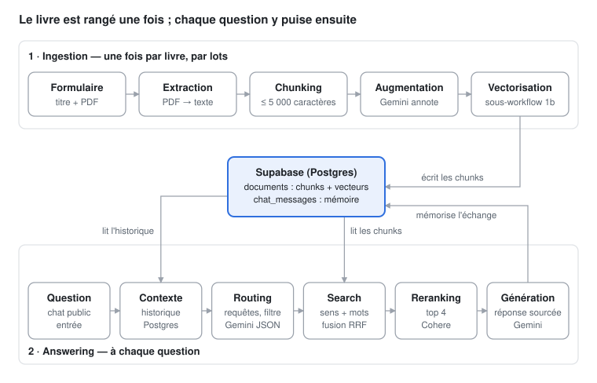

# Chatbot RAG · *The Almanack of Naval Ravikant*

Un chatbot n8n qui répond en français aux questions sur *The Almanack of Naval Ravikant* (Eric Jorgenson, 2020).
Il cite la partie, la section et la page de chaque passage utilisé, et refuse poliment ce qui sort du livre.



## Ingestion · `workflows/1-ingestion.json`

| Étape | Ce qui se passe | Outil |
|---|---|---|
| Extraction | Formulaire (titre + PDF), texte page par page | Form Trigger, Extract from File |
| Chunking | Nettoyage, structure lue dans le sommaire (partie › chapitre › section), découpe à 5 000 caractères sans overlap : 82 chunks | Code JS |
| Augmentation | Par chunk : contexte, 5 questions hypothétiques, mots-clés, entités et relations | Gemini 3.1 Flash-Lite |
| Vectorisation | Un chunk = une exécution du sous-workflow `1b`, embedding de 3 072 dimensions | Gemini embedding-001, Supabase pgvector |

## Answering · `workflows/2-answering.json`

| Étape | Ce qui se passe | Outil |
|---|---|---|
| Contexte | Question + 4 derniers échanges + réglages | Postgres |
| Routing | Question autonome FR/EN, requête, mots-clés, filtre de partie, détection du hors-sujet | Gemini 3.5 Flash-Lite (JSON) |
| Search | 15 passages par le sens + 15 par les mots, fusionnés (Reciprocal Rank Fusion) | pgvector, plein texte Postgres |
| Reranking | Garde les 4 passages qui répondent vraiment (score ≥ 0,1) | Cohere rerank-v3.5 |
| Génération | Réponse de 250 mots max, suivie de ses sources | Gemini 3.5 Flash-Lite |

Une réponse prend environ 6 secondes.

## Choix techniques

- **Chunks alignés sur les sections du livre**, pas sur une taille fixe : chaque citation renvoie à une vraie section.
- **Augmentation avant vectorisation** : les questions hypothétiques rapprochent la question de l'utilisateur du bon passage.
- **Recherche hybride** : le sens rate les termes exacts, les mots ratent les reformulations ; la fusion RRF garde le meilleur des deux.
- **Reranker dédié plutôt qu'un LLM** : environ 0,5 s, et un score fiable qui sert aussi de seuil de refus.
- **Ingestion reprenable** : `chunk_id` unique ; on redépose le PDF et seuls les chunks manquants sont traités, même après une panne de l'API.

## Lancer le projet

1. **Supabase** : exécuter [`supabase/setup.sql`](supabase/setup.sql).
2. **n8n** : importer les 4 fichiers de `workflows/` et recréer les credentials (Gemini, Supabase, Postgres, Cohere).
   Dans `1-ingestion`, relier le nœud « Vectoriser chaque chunk » au workflow `1b`. Dans `3-evaluation`, coller l'URL du chat.
3. **Indexer** : ouvrir le formulaire de `1-ingestion`, déposer le PDF avec le titre `The Almanack of Naval Ravikant`, et redéposer tant que le nœud Bilan n'affiche pas « Livre entièrement indexé ».
4. **Discuter** : ouvrir le chat public de `2-answering`.

## Évaluation · `workflows/3-evaluation.json`

16 questions envoyées au chatbot : 10 sur le livre, 2 de la vie réelle, 1 question de suivi et 3 hors sujet.
Une réponse compte si ses sources citent la section attendue.
**Résultat : 16/16** (10/10 livre, 2/2 vie réelle, suivi réussi, 3 refus sur 3). Détail : [`docs/evaluation.md`](docs/evaluation.md).

## Contenu du dossier

```
workflows/   les 4 workflows n8n, prêts à importer
code/        le JavaScript de chaque nœud Code, dans l'ordre du pipeline (copie lisible du JSON)
prompts/     les prompts d'augmentation, de routing et de génération
supabase/    tables, index et fonctions de recherche
docs/        schéma d'architecture et résultats de l'évaluation
```

Le livre est distribué gratuitement par son auteur sur [navalmanack.com](https://www.navalmanack.com) ; il n'est pas inclus dans ce dépôt.
